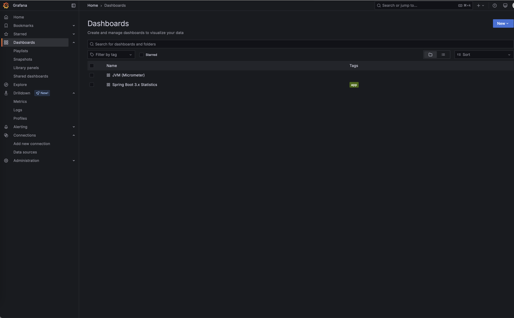

# 🛒 Order Processing System

A Java Spring Boot-based microservice that handles order placement and retrieval with robust observability and event-driven capabilities.

---

## 🚀 What This Project Does

This application exposes three REST endpoints to:

- **Place an order**
- **Retrieve all orders**
- **Retrieve paged orders**

Upon placing an order, it is:

- Persisted to the database (uses h2 embedded db for simplification)
- Published as an event to a RabbitMQ queue (`order-queue`) for downstream processing/analytics (handled outside this project scope)

Key features:

- **Exception handling & retry strategies**
- **Prometheus + Grafana** for metrics
- **Tempo** for distributed tracing
- **Loki** for centralized logging

## 📦 Prerequisites

- **Docker Desktop** installed and running
  > No need to install Java, RabbitMQ, Prometheus, Grafana, or any DB manually — everything is containerized.

---

## 🏗️ How to Build

1. Clone the repository:
   ```bash
   git clone https://github.com/Mani-Kanta-Reddy/order-processing.git
   cd order-processing
   ```

2. Build the application:
   ```bash
   ./mvnw spring-boot:build-image -DskipTests -Dspring-boot.build-image.imageName=order-processing-app
   ```

3. Launch the entire system using Docker:
   ```bash
   docker-compose up --build
   ```

4. Gracefully stop the entire system using Docker:
   ```bash
   docker-compose down -v
   ```

---

## 📡 How to Use

### ➕ Place an Order

`POST /api/v1/orders`

```http
POST http://localhost:8080/api/v1/orders
Content-Type: application/json

{
  "item": "Samsung-S23",
  "quantity": 3
}
```

**Response:**

```json
{
  "orderId": 1,
  "item": "Samsung-S23",
  "quantity": 3
}
```

---

### 📋 Get All Orders

`GET /api/v1/orders`

```http
GET http://localhost:8080/api/v1/orders
```

**Response:**

```json
[
  {
    "orderId": 1,
    "item": "Samsung-S23",
    "quantity": 3
  }
]
```

---

### 📄 Get Paged Orders

`GET /api/v1/orders/paged?page=0&size=1`

```http
GET http://localhost:8080/api/v1/orders/paged?page=0&size=1
```

**Response:**

```json
{
  "data": [
    {
      "orderId": 1,
      "item": "Samsung-S23",
      "quantity": 3
    }
  ],
  "currentPage": 0,
  "pageSize": 1,
  "totalElements": 1,
  "totalPages": 1,
  "last": true
}
```

---

## ⚙️ Business Logic

- Each order's **status** is tracked.
- Events sent to RabbitMQ are retried on failure.
- Orders remain in a `PENDING` state until event publication is successful.

---

## 📊 Observability

- **Metrics**: JVM, HTTP, DB, and custom metrics are exposed to Prometheus.
- **Logs**: All logs are collected by Promtail and can be visualized in Grafana via Loki.
- **Traces**: End-to-end request traces are available via Tempo.

---

## 📸 Sample Dashboards

### 🔍 Tempo Tracing View


### 📈 Prometheus Metrics View


### 📊 Grafana Dashboard



### 📜 Loki Logs View


### 🐇 RabbitMQ Queue


---
